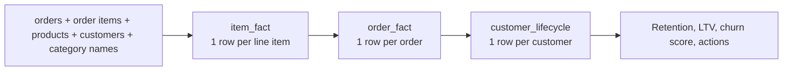

# ValueLoop

**Customer retention and lifetime value (LTV) analytics for e-commerce.** ValueLoop turns raw order data into cohort retention curves, LTV breakdowns, an explainable churn-risk score, and a prioritized list of customers to act on.

Built in Python with pandas, Plotly, and Streamlit. This version runs on the public [Olist Brazilian E-Commerce dataset](https://www.kaggle.com/datasets/olistbr/brazilian-ecommerce); you can also upload your own order data.


## What it does

| Area | Output |
| --- | --- |
| **Retention** | 30/60/90-day repeat-purchase rates and retention curves by acquisition-month cohort (adjustable 60–365 day horizon) |
| **LTV** | Revenue and LTV by acquisition month, product category, and customer state |
| **Churn risk** | An explainable 0–1 risk score per customer, grouped into low / medium / high bands |
| **Next best actions** | Rule-based targeting (winback, second-purchase nudge, VIP loyalty) with CSV export |

## Data model

The pipeline joins 5 raw tables into three fact tables, each at a different grain:



- **item_fact:** each line item with its product category (translated to English) and customer.
- **order_fact:** order-level revenue (price + freight), the order's highest-revenue category, and customer state. The dashboard and the upload path both use this grain.
- **customer_lifecycle:** first and last order, order count, total revenue, average order value, and days to next purchase.

## Results on the Olist dataset

| Metric | Value |
| --- | --- |
| Line items / orders / customers | 112,650 / 98,666 / 95,420 |
| Date range | Sep 2016 – Sep 2018 |
| Customers with 2+ orders | ~3.1% |
| 30 / 60 / 90-day repeat rate | ~1.6% / 1.9% / 2.1% |
| Average LTV | ~166 BRL |
| Coverage | 72 product categories, 27 states |

**Why is repeat purchasing so low?** Olist is a marketplace: most customers buy once from a third-party seller and never return. That makes it a useful test case, because the core question becomes *how do you earn the second purchase?* rather than *how do you keep loyal customers?*

## How the churn score works

The score is deliberately simple and explainable, not a black box:

- **60% recency** (days since last order): the strongest signal of disengagement
- **25% revenue** (inverse): lower-spending customers score as higher risk
- **15% frequency** (inverse): fewer orders score as higher risk

Each feature is scaled between its 5th and 95th percentiles so a few extreme customers cannot distort everyone else's score. Scores map to bands at 0.33 and 0.66, and the churn threshold (default 90 days) is adjustable in the app.

**Next best actions** then combine risk band, revenue, and order count:

| Rule | Action |
| --- | --- |
| High risk, above-median revenue | Winback: high-value |
| High risk, below-median revenue | Winback: promo |
| Medium risk, one order | Second-purchase nudge |
| Low risk, 3+ orders | VIP: loyalty / referral |
| Everyone else | Nurture |

## Quickstart

1. Clone the repo and install dependencies:

   ```bash
   git clone https://github.com/Ziyan14/valueLoop.git
   cd valueLoop
   python -m venv venv
   source venv/bin/activate      # Windows: venv\Scripts\activate
   pip install -r requirements.txt
   ```

2. Download the [Olist dataset from Kaggle](https://www.kaggle.com/datasets/olistbr/brazilian-ecommerce) and place these 5 files in an `archive/` folder (the data is not stored in this repo because of its size):

   - `olist_orders_dataset.csv`
   - `olist_order_items_dataset.csv`
   - `olist_products_dataset.csv`
   - `olist_customers_dataset.csv`
   - `product_category_name_translation.csv`

3. Run the app:

   ```bash
   streamlit run app.py
   ```

### Bring your own data

Upload an `order_fact` CSV in the app sidebar with these columns:

- `customer_unique_id`, `order_id`, `order_purchase_ts` (datetime), `order_revenue` (numeric)
- Optional: `primary_category`, `customer_state`

## Project structure

```
app.py            Streamlit dashboard (KPIs, 4 tabs, filters, CSV export)
metrics.py        Data preparation, retention, LTV, churn scoring, next best actions
requirements.txt  numpy, pandas, plotly, streamlit
archive/          Olist CSVs (download separately, git-ignored)
```

## Limitations and next steps

- All processing runs in memory with pandas; a production version would move the fact tables into a SQL database or warehouse.
- There is no automated test suite for the metric functions yet.
- The churn weights are hand-set heuristics; a next step is validating them against observed repeat purchases.
- No live store integration (e.g. Shopify) yet; the upload path is the bridge.
